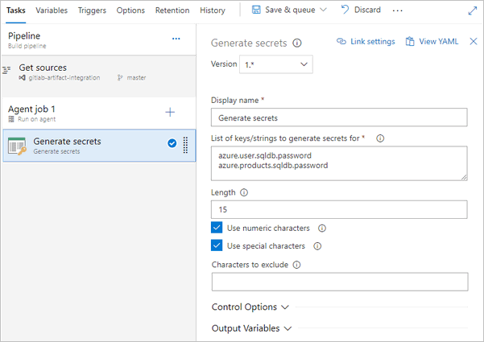
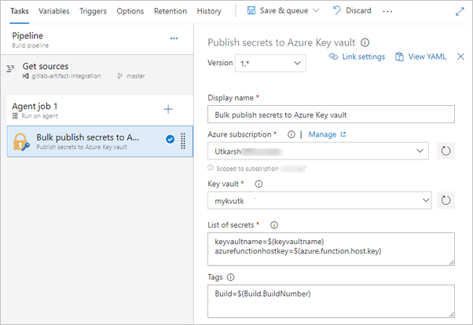

# Utkarsh Utility tasks

A set of utility build and release tasks to help you in your Azure Pipelines. The tasks in this extension are written in `node` and hence can be run in both Windows or Linux based agents.

## Tasks

This extension currently provides following tasks. I plan to add more in the future.

### 1. Generate Secrets

This task generates a secure string based on the given criteria. The task will be useful 

- When you do not want to mantain the passwords, secrets in your files and commit in the source control. Use this task to generate passwords/secrets on the fly. 
- You would like to rotate your passwords every few days and hence would like to generate new passwords in your pipeline.  

Once you configure and run this task in your pipeline, for each key, you will have a secret variable generated and the generated secret is assigned to it. You will be able to use the generated secret using the variable. For e.g. for the key `azure.user.sqldb.password` you will have a secret variable and can be accessed as `$(azure.user.sqldb.password)`.

#### Usage

- **List of keys/strings** - Provide a list of keys/strings to generate the secrets for. Each key can be separated by `,`, `;`, `|` or a newline. The secret generated for each key will be available via a secret variable which you can use it in other tasks. E.g. Secret generated for key `azure.sqldb.password` can be accessed using `$(azure.sqldb.password)`
- **Length** - Length of the secret. Optional field and if not provided defaults to 12.
- **Use numeric characters** - If `true`, adds numeric characters (`0123456789`) in the generated secret.
- **Use special characters** - If `true`, adds special characters (`~!@#$%^&()_+-={}[];\\',.`) in the generated secret.
- **Characters to exclude** - If you do not want any characters in the generated secret, add it here.

### 1. Publish Secrets to Azure Key vault

As the name suggests this task publishes the secrets to selected azure key vault. The advantage of using this task is you can publish secrets in bulk. Useful especially when you need to publish multiple secrets at once. The task also allows you to add optional tags to each secret you write. 

> *Note: The service principal/app you use in your endpoint should have permission to write secrets to key vault. Read more on how to create an Azure AD application and service principal that can access resources [here](https://docs.microsoft.com/en-us/azure/azure-resource-manager/resource-group-create-service-principal-portal).*

#### Usage

- **Azure Subscription** - Select the Azure subscription in which the Azure key vault exists.
- **Key vault** - The task pre-populates all the key vaults found in the subscription. 
- **List of secrets** - List of secrets to be added to the key vault. Add each secret as `secretname=secretvalue` and separate each pair by a newline. E.g. `Password=$(MySecretPassword)`
- **Tags** - List of tags to be added to each secret. Add as `tagName=tagValue` and separate each pair by newline. E.g. `Build=$(Build.BuildNumber)`. **Note**: If you are updating existing secrets, any existing tags will be overwritten.

## Changes

> - 1.0 - Initial release

## Feedback

Please rate the extension and share/tweet to spread the word!!

- Found a bug or need to make a feature request? - Raise it as an [issue](https://github.com/onlyutkarsh/utkarsh-utility-tasks/issues).
- Have a question? - Raise it here in the Q and A section.